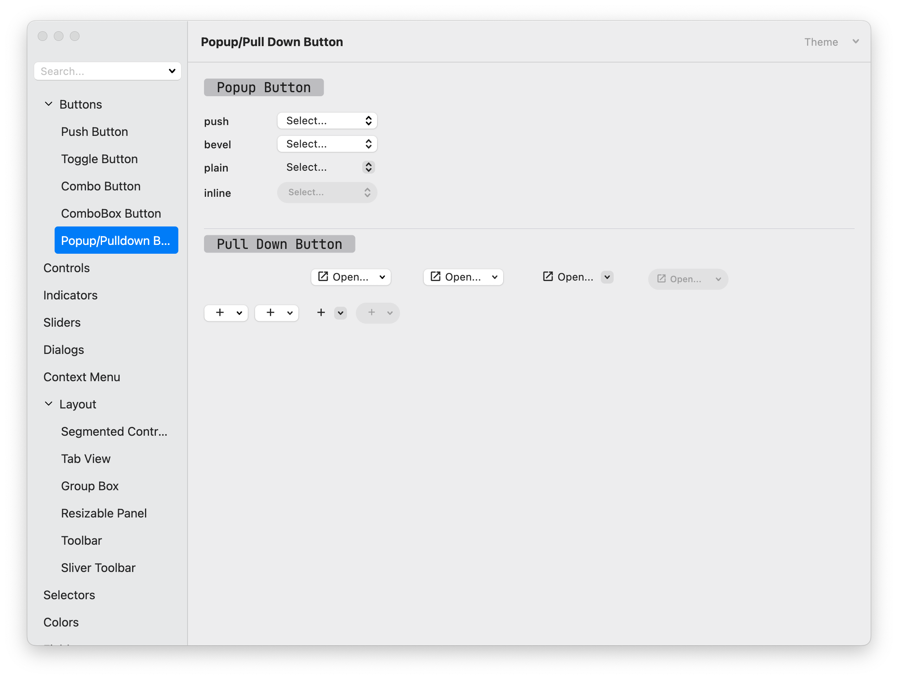

<!--
This README describes the package. If you publish this package to pub.dev,
this README's contents appear on the landing page for your package.

For information about how to write a good package README, see the guide for
[writing package pages](https://dart.dev/tools/pub/writing-package-pages).

For general information about developing packages, see the Dart guide for
[creating packages](https://dart.dev/guides/libraries/create-packages)
and the Flutter guide for
[developing packages and plugins](https://flutter.dev/to/develop-packages).
-->

Flutter widgets and themes implementing the current macOS design language. It has been inspired by the <a href='https://pub.dev/packages/macos_ui'>macos_ui</a> flutter package.




## Features

A complete set of components (including some not bundled with the macos_ui package).

## Resources

 * <a href='https://developer.apple.com/design/resources/'>Apple Design Resources</a>

## Usage

TODO: Include short and useful examples for package users. Add longer examples
to `/example` folder.

```dart

class _MyHomePageState extends State<MyHomePage> {
  int pageIndex = 0;

  @override
  Widget build(BuildContext context) {
    return PlatformMenuBar(
      menus: const [],
      child: AppKitWindow(
        endSidebar: AppKitSidebar(
            shownByDefault: false,
            builder: (context, scrollController) {
              return Container();
            },
            minWidth: 150),
        sidebar: AppKitSidebar(
            builder: (context, scrollController) {
              return AppKitSidebarItems(
                  scrollController: scrollController,
                  itemSize: AppKitSidebarItemSize.large,
                  items: const [
                    AppKitSidebarItem(label: Text('Buttons'), disclosureItems: [
                      AppKitSidebarItem(label: Text('Push Button')),
                      AppKitSidebarItem(label: Text('Toggle Button')),
                      AppKitSidebarItem(label: Text('Combo Button')),
                      AppKitSidebarItem(label: Text('ComboBox Button')),
                      ...
                    ]),
                  ],
                  currentIndex: pageIndex,
                  onChanged: (index) {
                    setState(() {
                      pageIndex = index;
                    });
                  });
            },
            minWidth: 200),
        child: [
          const PushButtonPage(),
          ...
        ][pageIndex],
      ),
    );
  }
}

```

